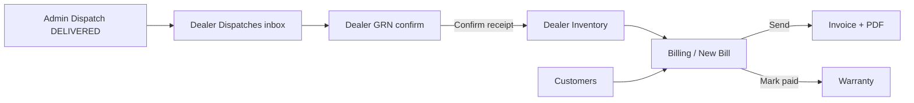

# Dealer Panel — UI/UX Roadmap

Work through modules **in sidebar order**. Mark status as you go: `⬜` pending · `🔄` in progress · `✅` done

**Login for testing:** `dealer@haion.com` / `password` (DEALER_ADMIN) · `sales@haion.com` (DEALER_SALES)

---

## Dealer business flow (real chain)



**Roles**

| Role | Sees |
|------|------|
| `DEALER_ADMIN` | Full sidebar including Dashboard, Reports, Team |
| `DEALER_SALES` | Dispatches, GRN, Inventory, Customers, Billing, Invoices, Warranty (no Dashboard/Team/Reports) |

---

## Shared foundations (reuse from Admin)

| Item | Status | Notes |
|------|--------|-------|
| `DetailPageShell` + breadcrumbs on detail pages | ⬜ | Most dealer details still use plain `PageShell` |
| Sidebar badges (GRN, dispatch) | ✅ | `useSidebarBadges` already runs for `panel === 'dealer'` |
| Dashboard loading skeleton + date filter | ⬜ | `DealerDashboard` uses API charts but no skeleton/filter hook |
| Empty states on all list tables | ⬜ | |
| Strip `withMockFallback` from dealer services | ⬜ | See API table below |

---

## API wiring status

| Service | Mock fallback? | Backend route |
|---------|----------------|---------------|
| `customers.service` | ✅ Direct API | `/api/customers` |
| `billing.service` | ✅ Direct API | `/api/billing` |
| `invoices.service` | ✅ Direct API | `/api/invoices` (+ PDF) |
| `warranty.service` | ⚠️ Mock fallback | `/api/warranty` |
| `dealer-grn.service` | ❌ Mock fallback | `/api/dealer/grn` |
| `dealer-dispatch.service` | ❌ Mock fallback | `/api/dealer/dispatches` |
| `dealer-inventory.service` | ❌ Mock fallback | `/api/dealer/inventory` |
| `dealer-team.service` | ❌ Mock fallback | `/api/dealer/team` |
| `dealer-reports.service` | ❌ Mock fallback | `/api/dealer/reports` |

**Priority P0:** Strip mock from the five `dealer-*` services so the inventory chain works with `VITE_USE_MOCK_API=false`.

---

## Module checklist (sidebar order)

| # | Module | Status | Key UX items |
|---|--------|--------|--------------|
| 1 | **Dashboard** | ⬜ | Loading skeleton, date filter, quick actions (New Bill, Pending GRN) |
| 2 | **Dispatches** | ⬜ | Direct API, DetailPageShell, tracking timeline, status context |
| 3 | **GRN** | 🔄 | Confirm receipt works in panel; needs DetailPageShell, breadcrumbs, empty state |
| 4 | **Inventory** | ⬜ | Direct API, search/filter, empty state, detail breadcrumbs |
| 5 | **Customers** | 🔄 | Create drawer exists; DetailPageShell, search/empty states |
| 6 | **Billing** | 🔄 | Invoice builder wired; list empty state, detail send/paid/cancel actions visible |
| 7 | **Invoices** | 🔄 | PDF download works; DetailPageShell, link back to bill |
| 8 | **Warranty** | ⬜ | Direct API, lookup from invoice, certificate view |
| 9 | **Reports** | ⬜ | Direct API, generate/view dealer reports |
| 10 | **Team** | ⬜ | Direct API, performance page KPIs, empty states |

---

## Suggested work order (tomorrow)

### Phase 1 — Wire real API (blocker)
1. Rewrite `dealer-grn.service.js`, `dealer-dispatch.service.js`, `dealer-inventory.service.js`, `dealer-team.service.js`, `dealer-reports.service.js` to direct API (mirror admin pattern).
2. Strip `warranty.service` mock fallback.

### Phase 2 — Inventory chain UX (sidebar 2–4)
3. **Dispatches** — `DetailPageShell`, timeline empty state, link to GRN when delivered.
4. **GRN** — `DetailPageShell`, improve confirm CTA, empty states on list.
5. **Inventory** — search, filters, empty state, detail breadcrumbs.

### Phase 3 — Revenue chain (sidebar 5–8)
6. **Customers** — DetailPageShell, search/filter polish.
7. **Billing** — detail actions (Send, Mark Paid, Cancel), status badges.
8. **Invoices** — DetailPageShell, PDF download CTA prominent.
9. **Warranty** — list + detail from paid bills.

### Phase 4 — Management (sidebar 1, 9–10)
10. **Dashboard** — skeleton, date filter, quick actions.
11. **Reports** + **Team** — list/detail polish.

---

## Patterns to follow

```jsx
// Detail pages (same as admin)
<DetailPageShell back={{ label: 'GRN', href: '/dealer/grn' }} title={data?.grnNo} actions={...}>
  <DealerGRNDetailPanel id={id} />
</DetailPageShell>

// Confirm action (GRN — already in DealerGRNDetailPanel)
dealerGrnService.confirm(id)  // POST /api/dealer/grn/:id/confirm
```

---

## E2E test script (after MongoDB + seed)

1. Login `warehouse@haion.com` → create dispatch → mark **DELIVERED**
2. Login `dealer@haion.com` → **Dispatches** → see shipment
3. **GRN** → **Confirm Receipt** → stock in **Inventory**
4. **Customers** → add customer
5. **Billing → New** → multi-line bill → **Send** → **Invoices** → download PDF
6. **Mark Paid** → check **Warranty**

---

## Related docs

- Admin flow (upstream): `docs/frontend/ADMIN-UX-ROADMAP.md`
- System walkthrough: `docs/SYSTEM-WALKTHROUGH.md` (Flow 1 + Flow 2)
